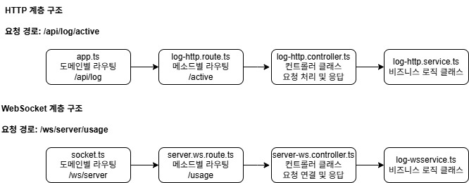

# 1. dockwatch-agent

**[ver: 0.9.0](https://github.com/jin7942/dockwatch-agent/releases/tag/v0.9.0)**

Dockwatch 프로젝트에서 도커 컨테이너와 서버 리소스 등을 수집하여 실시간, HTTP 로 제공하는 에이전트 입니다. 실행 파일을 데몬으로 등록하여 사용하거나, node로 사용할 수 있습니다.

해당 에이전트는 보안 로직이 포함되어 있지 않습니다. 모든 보안 및 인증은 [dockwatch-backend](https://github.com/jin7942/dockwatch/backend) 에서 수행합니다.

해당 에이전트는 TypeScript + Express 로 제작 되었으며, 코드 컨벤션은 [typescript-nodejs-convention.md](https://github.com/jin7942/dev-guide/blob/main/typescript-nodejs-convention.md)를 따릅니다.

POSTMAN 테스트를 위한 컬렉션을 제공합니다. [dockwatch-agent-collection](./dockwatch-agent.postman_collection.json) 파일을 포스트맨에서 임포트하여 사용하실 수 있습니다. WebSocket요청은 컬렉션에 작성된 내용으로 직접 추가해야 합니다.

dockwatch의 전체 실행 흐름및 기능, 데모를 보실려면 아래 링크로 방문하십시오.

전체 프로젝트 보기 [dockwatch](https://github.com/jin7942/dockwatch)

## 1.1. 기능 요약

-   도커 컨테이너 정보 조회(상태, 실행시간, 리소스 등)
-   서버 리소스 사용률 실시간 수집(CPU, 메모리, 디스크)
-   로그 파일 구조 탐색 및 제공(Tree View)
-   실시간 로그 스트리밍(Websocket)
-   REST API 및 WebSocket API 제공

## 1.2. 실행방법

### 1.2.1. 실행 파일

[v0.9.0 릴리즈](https://github.com/jin7942/dockwatch-agent/releases/tag/v0.9.0) 에서 실행 파일을 다운로드하여 사용할 수 있습니다.

현재는 **Linux-64만 지원(Node.js 불피요, 실행파일 standalone)** 하며, 타 OS환경은 직접 패키징을 필요로 합니다.

```bash
wget https://github.com/jin7942/dockwatch-agent/releases/download/v0.9.0/dockwatch-agent
```

```bash
chmod +x dockwatch-agent
```

```bash
./dockwatch-agent
```

### 1.2.2. 노드 런타임에서 실행

```bash
git clone https://https:/github.com/jin7942/dockwatch-agent
```

```bash
cd dockwatch-agent
```

```bash
npm install
```

```bash
npm start
```

**기본 포트: 7000**

# 2. API 명세서

모든 HTTP/WS 엔드포인트와 요청/응답 형식은 별도 문서인 [DOCUMENT.md](./DOCUMENT.md)에 정리되어 있습니다.

# 3. 계층 구조



**개요**

-   dockwatch-agent는 도메인 단위의 요청 분기, HTTP/WS 라우팅, 컨트롤러, 서비스 로직 분리의 계층 구조를 따릅니다.
-   HTTP와 WebSocket 요청 모두 동일한 흐름을 따르되, 라우팅 및 연결 방식만 차이가 있습니다.
-   WebSocket에서는 클라이언트의 메시지 전송은 차단되어 있으며, 서버에서의 단방향 데이터 전송만 허용됩니다.
-   모든 컨트롤러 호출은 async-handler.ts로 래핑되어 예외 처리를 중앙화하고 있습니다.

**HTTP 요청 흐름**

1. app.ts에서 요청 URI에 따라 도메인 라우팅 수행 (/api/log 등).

2. 각 도메인 폴더의 \*.route.ts 파일에서 HTTP 메서드 기반으로 경로를 세분화하고 컨트롤러로 위임.

3. \*.controller.ts에서 요청 파라미터 검증 및 서비스 호출 처리.

4. \*.service.ts에서 비즈니스 로직 처리 후 응답 반환.

**WebSocket 요청 흐름**

1. socket.ts에서 접속 경로(/ws/server)에 따라 WebSocket 서버에 연결.

2. 각 도메인의 \*.ws.route.ts에서 요청 경로(/usage)를 기반으로 핸들러 등록.

3. \*.ws.controller.ts에서 유효성 검사 및 서비스 호출 처리.

4. \*.ws.service.ts에서 실시간 데이터 처리 및 전송 수행.

**설계 의도**

-   라우팅부터 로직 처리까지 명확한 책임 분리를 통해 유지보수성과 확장성을 확보하였으며, 단일 책임 원칙(SRP)을 준수했습니다.
-   컨트롤러는 유효성 검증 및 흐름 제어에 집중하고, 서비스는 순수 로직만 처리하도록 관심사 분리를 명확히 했습니다.
-   WebSocket 또한 동일한 계층 구조를 따르며, HTTP와 일관된 설계 철학을 유지하고 있습니다.

## 3.1. 디렉터리 구조

```bash
src
├── common                                  // 공통 파일 모음
│   ├── error
│   │   ├── custom-error.ts                 // 커스텀 에러 정의
│   │   └── error-handler.ts                // 전역 에러 핸들러
│   ├── middleware
│   │   └── async-handler.ts                // 전역 async 핸들러
│   ├── types
│   │   ├── http-status.enum.ts             // HTTP 상태코드 enum 파일
│   │   ├── response.vo.ts                  // HTTP 공통 응답 포멧
│   │   └── ws.vo.ts                        // WS 공통 응답 포멧
│   └── utils                               // 유틸 함수 모음
│       ├── create-util.ts
│       ├── docker-util.ts
│       ├── parser-util.ts
│       └── ws-util.ts
├── container                               // 컨테이너 도메인 관련 모음
│   │   ├── container-http.controller.ts    // http 컨트롤러 클래스
│   │   └── container-ws.controller.ts      // ws 컨트롤러 클래스
│   ├── dto                                 // 데이터 전송용 객체 인터페이스 모음
│   │   ├── container-http.dto.ts           // http 요청 객체 인터페이스 정의
│   │   ├── container-http.vo.ts            // http 응답 객체 인터페이스 정의
│   │   └── container-ws.vo.ts              // ws 응답 객체 인터페이스 정의
│   ├── route                               // 메소드별 라우팅
│   │   ├── container-http.route.ts         // http 라우팅 클래스
│   │   └── container-ws.route.ts           // ws 라우팅 클래스
│   └── service                             // 서비스 레이어
│       ├── container-http.service.ts       // http 서비스 클래스
│       └── container-ws.service.ts         // ws 서비스 클래스
├── dashboard
│   ├── controller
│   ├── dto
│   ├── route
│   └── service
├── log
│   ├── controller
│   ├── dto
│   ├── route
│   └── service
├── server
│   ├── controller
│   ├── dto
│   ├── route
│   └── service
│
├── app.ts                      // express router 도메인별 라우팅
├── index.ts                    // 실행 엔트리 포인트
└── ws
    └── socket.ts               // WebSocket 도메인별 라우팅
```

# 4. 실행 흐름

아래 플로우 차트는 위 계층 구조를 기반으로 실제 요청 흐름을 시각화한 것입니다.

## 4.1. HTTP


## 4.2. WebSocket


# 5. 시스템 요구 사항

-   Node.js 18+

# 6. 라이선스

MIT
